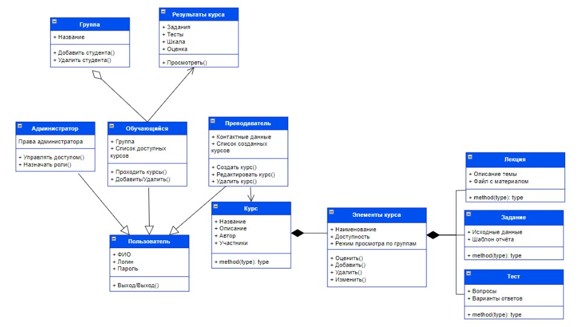
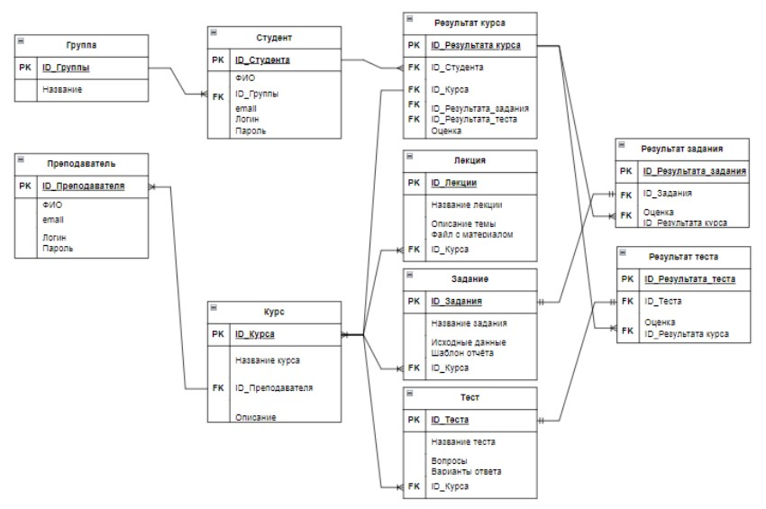

<h1 align="center">Akhmad-courses</h1> 

## Описание
Akhmad-courses - это платформа для обучения, упрощенная версия Moodle
### Возможности:
#### Каждый пользователь приложения может:
- Войти в личный кабинет и выйти.

#### Возможности преподавателей:
- Создать свой курс.
- Составлять и редактировать элементы своего курса.
- Оценивать работы студентов.

#### Возможности студентов:
- Выбор группы
- Просмотр доступных курсов
- Прохождение курсов, в том числе:
    - Просмотр списка элементов курса
    - Просмотр каждого элемента курса отдельно
    - Прохождение тестов
    - Загрузка выполненных заданий
#### Возможности администратора:
- Администрировать платформу:
    - Создавать учетные записи для остальных юзеров, назначать роли и группы для преподовов и студентов.
    - Удалять учетные записи

## Проектирование
Диаграмма классов

Схема базы данных

