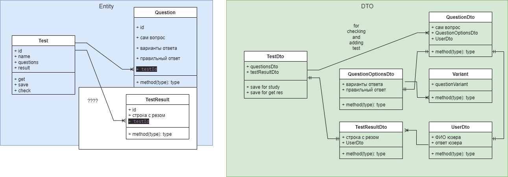

<h1 align="center">Akhmad-courses</h1>

### Описание
Akhmad-courses - это платформа для обучения, упрощенная версия Moodle
### Возможности:
Каждый пользователь приложения может:
- Создавать тесты;
- Проходить тесты;
- Просматривать результаты
### Проектирование
Диаграмма классов (примерная)

